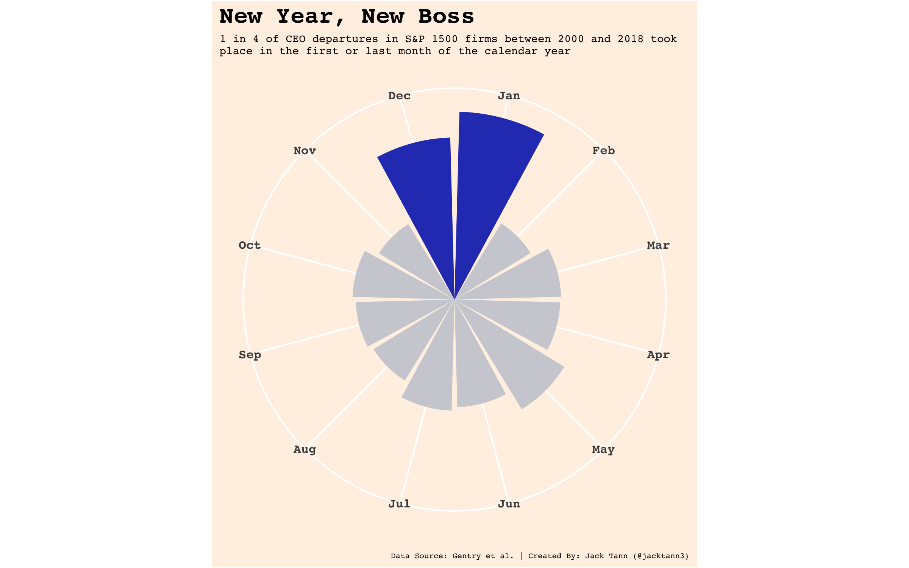
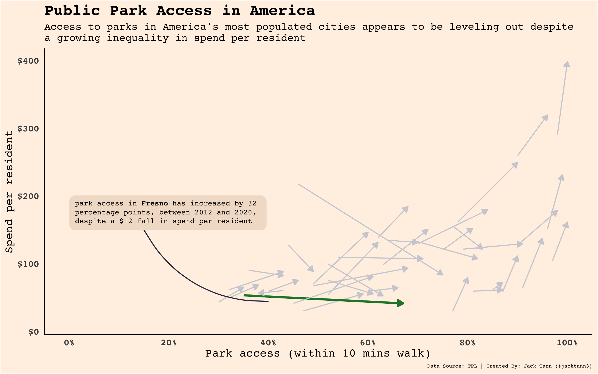

# Tidy Tuesday

A repo containing my data viz submissions for the #TidyTuesday initiative.

## 2021

### Week 7 - Wealth Inequality in America

### Week 8 - W.E.B. Du Bois Challenge

### Week 9 - Income Inequality in America

### Week 10 - Superbowl Ads

### Week 11 - Bechdel Test

### Week 14 - Makeup Shades

### Week 15 - Global Deforestation

### Week 18 - CEO Departures

### Week 24 - Great Lakes Fish

### Week 26 - Public Park Access

### Week 27 - Animal Rescues

### Week 28 - Independence Days

